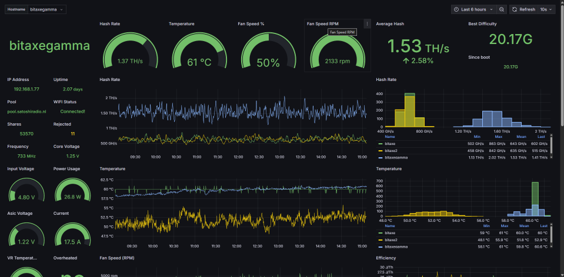

<p align="center">
  
</p>

# AxeOS Monitor (All-in-One) on StartOS

An all-in-one monitoring solution for [AxeOS](https://github.com/skot/ESP-Miner) (ESP-Miner) Bitaxe miners, bundling **Grafana 12.4**, **Prometheus**, and **JSON Exporter** into a single StartOS service. Includes a preconfigured dashboard; no manual setup required beyond providing your miner's IP address.

<p align="center">
  
</p>

---

## Table of Contents

- [Image and Container Runtime](#image-and-container-runtime)
- [Volume and Data Layout](#volume-and-data-layout)
- [Installation and First-Run Flow](#installation-and-first-run-flow)
- [Configuration Management](#configuration-management)
- [Network Access and Interfaces](#network-access-and-interfaces)
- [Actions](#actions)
- [Backups and Restore](#backups-and-restore)
- [Health Checks](#health-checks)
- [Dependencies](#dependencies)
- [Limitations and Differences](#limitations-and-differences)
- [What Is Unchanged from Upstream](#what-is-unchanged-from-upstream)
- [Contributing](#contributing)
- [Quick Reference for AI Consumers](#quick-reference-for-ai-consumers)

---

## Image and Container Runtime

Three unmodified upstream Docker images run as separate subcontainers:

| Subcontainer  | Image                                      | Architectures          |
|---------------|--------------------------------------------|------------------------|
| `grafana`     | `grafana/grafana:12.4.3`                   | x86_64, aarch64        |
| `prometheus`  | `prom/prometheus:v3.11.2`                  | x86_64, aarch64        |
| `json-exporter` | `prometheuscommunity/json-exporter:v0.7.0` | x86_64, aarch64      |

All images use their upstream default entrypoints (`/run.sh` for Grafana, `/bin/prometheus` and `/bin/json_exporter` respectively).

---

## Volume and Data Layout

| Volume       | Subpath                        | Mounted at (in subcontainer) | Contents                                  |
|--------------|--------------------------------|------------------------------|-------------------------------------------|
| `grafana`    | `/var/lib/grafana`             | `/var/lib/grafana`           | Grafana database, sessions, plugins       |
| `grafana`    | `/etc/grafana/provisioning`    | `/etc/grafana/provisioning`  | Auto-populated provisioning config        |
| `grafana`    | `/etc/grafana/dashboards`      | `/etc/grafana/dashboards`    | Active dashboard JSON (version-selected)  |
| `prometheus` | `prometheus/`                  | `/prometheus`                | Prometheus TSDB data                      |
| `prometheus` | `etc/prometheus/`              | `/etc/prometheus`            | `prometheus.yml`, scrape configs, `store.json` |

`store.json` (inside the `prometheus` volume at `etc/prometheus/store.json`) persists the selected AxeOS/ESP-Miner version between restarts.

Grafana provisioning files and the active dashboard JSON are copied from package assets into the volumes on every startup.

---

## Installation and First-Run Flow

On first install, the service creates a critical task prompting you to:

1. **Enter your Bitaxe/AxeOS IP address(es)** — one per line
2. **Select your AxeOS/ESP-Miner version** — `>= 2.11.x` or `<= 2.10.x`

These can be changed later via the **Configure AxeOS Monitor** action.

Grafana starts with anonymous access enabled and the AxeOS dashboard set as the home dashboard. No login is required.

---

## Configuration Management

| StartOS-Managed                                          | Grafana UI / Upstream                         |
|----------------------------------------------------------|-----------------------------------------------|
| Prometheus scrape targets (Bitaxe IP addresses)          | Additional Grafana dashboards and panels      |
| AxeOS/ESP-Miner version selection                        | Grafana user accounts and preferences         |
| Prometheus scrape interval                               | Alerting rules (not provisioned)              |
| Grafana analytics and update checks (disabled)           | Prometheus retention and storage settings     |
| Home dashboard (`axeos.json`)                            |                                               |

Grafana's `GF_ANALYTICS_*` env vars are set to disable telemetry and update checks.

---

## Network Access and Interfaces

| Interface    | Port | Protocol | Purpose                        |
|--------------|------|----------|--------------------------------|
| `ui`         | 3000 | HTTP     | Grafana dashboard UI           |
| `prometheus` | 9090 | HTTP     | Prometheus raw metrics browser |

Both interfaces are accessible over LAN (`.local`) and Tor (`.onion`).

---

## Actions

### Configure AxeOS Monitor
- **Purpose:** Set Bitaxe/AxeOS IP address(es) to scrape, select ESP-Miner version, and set scrape interval
- **Visibility:** Enabled
- **Availability:** Any status
- **Inputs:** IP addresses (one per line), AxeOS version (`>= 2.11.x` / `<= 2.10.x`), scrape interval in seconds
- **Outputs:** Writes scrape config to Prometheus and restarts Prometheus if the version changed

### Reload Prometheus Config *(internal)*
- **Purpose:** Sends a live reload request to Prometheus (`/-/reload`) without restarting the service
- **Visibility:** Hidden (used internally by Configure action)

---

## Backups and Restore

Both volumes are backed up:

- `grafana` — Grafana database, sessions, user data
- `prometheus` — TSDB metrics data, scrape config, store

On restore, all data is fully restored. Prometheus metrics history is included.

---

## Health Checks

| Daemon         | Method               | Endpoint / Port | Grace Period | Success Message         |
|----------------|----------------------|-----------------|--------------|-------------------------|
| `json-exporter`| TCP port check       | 7979            | —            | JSON Exporter is ready  |
| `prometheus`   | TCP port check       | 9090            | —            | Prometheus is ready     |
| `grafana`      | HTTP URL check       | 3000            | 60 s         | Grafana is ready        |

Grafana has a 60-second grace period to allow time for the unified storage migration on startup.

---

## Dependencies

None.

---

## Limitations and Differences

1. Grafana runs without authentication — the UI is open to anyone with network access to your StartOS server. This is intentional for ease of use on a private home network.
2. The provisioned datasource (`startosprometheus`) and home dashboard are read-only from within Grafana's UI — changes to the provisioning config must be made via the Configure action.
3. Prometheus retention and storage settings are not configurable through the StartOS UI; defaults apply.
4. Alerting is not configured out of the box; `manageAlerts: true` is set in the datasource config but no alert rules are provisioned.
5. Only two AxeOS/ESP-Miner API versions are supported: `>= 2.11.x` and `<= 2.10.x`. Other versions may work but are not tested.

---

## What Is Unchanged from Upstream

- Grafana's full dashboard and visualization feature set works as upstream
- Prometheus query language (PromQL) and remote read/write behave as upstream
- JSON Exporter config syntax and behavior are unchanged
- All three services run their upstream default entrypoints without modification

---

## Contributing

See [CONTRIBUTING.md](CONTRIBUTING.md) for build environment setup and CI pipeline details.

---

## Quick Reference for AI Consumers

```yaml
package_id: axeos-monitor-aio
upstream_version: "grafana:12.4.3 / prometheus:3.11.2 / json-exporter:0.7.0"
images:
  - grafana/grafana:12.4.3
  - prom/prometheus:v3.11.2
  - prometheuscommunity/json-exporter:v0.7.0
architectures: [x86_64, aarch64]
volumes:
  grafana: /var/lib/grafana, /etc/grafana/provisioning, /etc/grafana/dashboards
  prometheus: /prometheus, /etc/prometheus
ports:
  ui: 3000
  prometheus: 9090
dependencies: none
startos_managed_env_vars:
  - GF_ANALYTICS_REPORTING_ENABLED
  - GF_ANALYTICS_CHECK_FOR_UPDATES
  - GF_ANALYTICS_CHECK_FOR_PLUGIN_UPDATES
  - GF_ANALYTICS_FEEDBACK_LINKS_ENABLED
  - GF_DASHBOARDS_DEFAULT_HOME_DASHBOARD_PATH
  - GF_LOG_LEVEL
actions:
  - config
  - reload-prometheus-config
```
